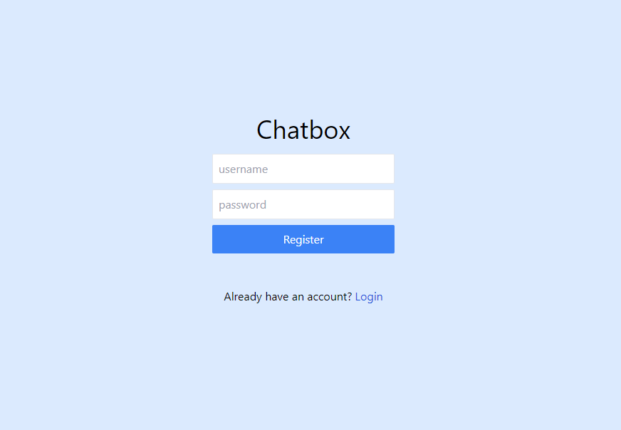
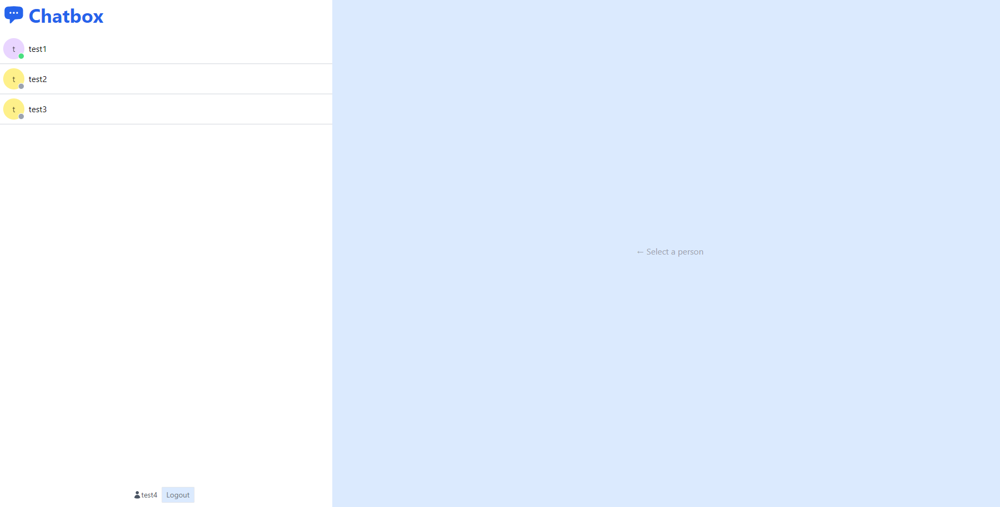
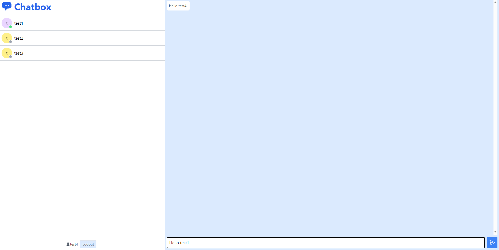

# Chatbox

A global chat application where you can talk to anyone connected!

Authentication page:


Home page:


Chat page:


## Current Functionalities:
- User can register and sign in using username & password
- Chat with anyone online

## Technologies used:
- ReactJs
- NodeJs
- MongoDB
- Tailwind
- MERN

## Setup
To run this project, fork a copy of the project then:

To start the frontend:
```
$ cd to frontend directory
$ npm i
$ npm start
```

To start the backend:
```
$ cd to server directory
$ npm i
$ npm start
```


